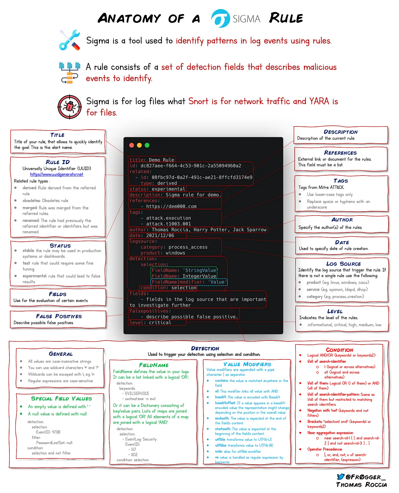

Digital Forensics and Incident Response (DFIR) is a field within cybersecurity that focuses on the identification, investigation, and remediation of cyber attacks.

DFIR has two main components:
* __Digital Forensic__: A subset of forensic science that examines system data, user activity, and other pieces of digital evidence to determine if an attack is in progress and who may be behind the activity.
* __Incident Response__: The overarching process that an organization will follow in order to prepare for, detect, contain, and recover from a data breach.


## Best resources to dive into DFIR

* [thedfirreport.com](https://thedfirreport.com/) - Learn from attacks by reading DFIR Reports and adopt IOCs 
* [detection.fyi](https://detection.fyi/) - Awesome resource for tons of Sigma Rules (thedfirreport also has great Sigma Rules) 
* [Sigma-CLI](https://github.com/SigmaHQ/sigma-cli) - Starting point for learning Sigma Rules
* [Tsurugi-DFIR-Linux](https://tsurugi-linux.org/)
* [FalconHound](https://github.com/FalconForceTeam/FalconHound) - FalconHound is a blue team multi-tool. It allows you to utilize and enhance the power of BloodHound in a more automated fashion.


## Sigma Rules



Source: [Twitter - fr0gger](https://twitter.com/fr0gger_/status/1417517811442798593?lang=en)

## Benji's Linux DFIR Script

This Bash script is designed for conducting digital forensics on Linux systems. The script automates the collection of a wide range of system and user data that could be used during DFIR investigations.

__Features:__

- **System Information**: Collects basic system information including uptime, startup time, and hardware clock readouts.
- **Operating System Details**: Extract information about the operating system installation, including installer logs and file system details.
- **Network Information**: Gathers network configuration, IP addresses, and network interface details.
- **Installed Programs**: Lists all installed packages using both `rpm` and `apt`.
- **Hardware Information**: Retrieves detailed information about PCI devices, hardware summaries, and BIOS data.
- **System Logs**: Captures system journal logs and the contents of the `/var/log` directory.
- **User Data**: Extracts user-specific data like recently used files and bash command history and zsh command history.
- **Memory Dump**: Performs a memory dump for detailed analysis.
- **Process Information**: Captures information about current running processes.
- **User Login History**: Records user login history and scheduled tasks.
- **Secure Output Handling**: Compresses and encrypts the gathered data for security.

 Usage:

 **Set Permissions**: Ensure the script is executable:
   ```bash
   sudo apt-get install util-linux  # For Debian/Ubuntu
   sudo yum install util-linux  # For CentOS/RHEL
   chmod +x DFLinux.sh
   sudo ./DFLinux.sh
   ```
   Output: Check the specified output directory for the collected data.

Requirements:
- The script is intended for use on Linux systems.
- Please make sure you have the necessary permissions to execute the script and access system files.
- Required tools: dump, gpg, netstat, ifconfig, lshw, dmidecode, etc., should be installed.

<!-- cSpell:disable -->
```bash
#!/bin/bash

output_dir="/tmp/ExtractedInfo"
logfile="$output_dir/forensics_log.txt"

initialize_logs() {
    echo "Forensic data extraction started at $(date)" > "$logfile"
}

write_output() {
    local command="$1"
    local filename="$2"

    if $command > "$output_dir/$filename" 2>&1; then
        echo "Successfully executed: $command" >> "$logfile"
    else
        echo "Failed to execute: $command" >> "$logfile"
    fi
}

check_and_write_history() {
    local user_home="$1"
    local username="$2"

    if [ -f "$user_home/.bash_history" ]; then
        write_output "cat $user_home/.bash_history" "bash_command_history_$username.txt"
    else
        echo "No .bash_history for $username" >> "$output_dir/bash_command_history_$username.txt"
    fi

    if [ -f "$user_home/.zsh_history" ]; then
        write_output "cat $user_home/.zsh_history" "zsh_command_history_$username.txt"
    else
        echo "No .zsh_history for $username" >> "$output_dir/zsh_command_history_$username.txt"
    fi

    write_output "cat $user_home/.local/share/recently-used.xbel" "recently_used_files_$username.txt"
}

initialize_logs

# System Information Extraction
write_output "uptime -p" "system_uptime.txt"
write_output "uptime -s" "system_startup_time.txt"
write_output "date" "current_system_date.txt"
write_output "date +%s" "current_unix_timestamp.txt"

if command -v hwclock &>/dev/null; then
    write_output "hwclock -r" "hardware_clock_readout.txt"
else
    echo "hwclock command not found" >> "$logfile"
fi

# Operating System Installation Date
write_output "df -P /" "root_filesystem_info.txt"
write_output "ls -l /var/log/installer" "os_installer_log.txt"
write_output "tune2fs -l /dev/sda1" "root_partition_filesystem_details.txt" # Check for correct root partition

# Network Information
write_output "ifconfig" "network_configuration.txt"
write_output "ip addr" "ip_address_info.txt"
write_output "netstat -i" "network_interfaces.txt"

# Installed Programs
write_output "dpkg -l" "dpkg_installed_packages.txt" # Replaced 'apt' with 'dpkg -l'
write_output "rpm -qa" "rpm_installed_packages.txt"

# Hardware Information
write_output "lspci" "pci_device_list.txt"
write_output "lshw -short" "hardware_summary_report.txt"
write_output "dmidecode" "dmi_bios_info.txt"

# System Logs and Usage
write_output "journalctl" "system_journal_logs.txt"
write_output "ls -lah /var/log/" "var_log_directory_listing.txt"

for user_home in /home/*; do
    username=$(basename "$user_home")
    check_and_write_history "$user_home" "$username"
done

if crontab -l &>/dev/null; then
    write_output "crontab -l" "scheduled_cron_jobs_root.txt"
else
    echo "No crontab for root" >> "$output_dir/scheduled_cron_jobs_root.txt"
fi

tar -czf "$output_dir/user_data.tar.gz" -C "$output_dir" ./*.txt --remove-files

echo "Data extraction complete. Check the $output_dir directory for output." >> "$logfile"
echo "Forensic data extraction completed at $(date)" >> "$logfile"

echo "Data extraction complete. Check the $output_dir directory for output."
```
<!-- cSpell:enable -->